# PRD — LightRAG Engine Integration for RAG Medan v4

**Document:** `lightrag-engine.md`  
**Status:** Target Architecture / Implementation Specification  
**Scope:** Integrasi LightRAG sebagai primary unified retrieval engine untuk RAG Medan  
**Existing system:** RAG Medan v3  
**Target system:** RAG Medan v4 — Existing Ingestion + LightRAG Retrieval Engine
**Repository LightRAG:** https://github.com/HKUDS/LightRAG
---

## 1. Ringkasan

RAG Medan v3 saat ini memiliki tiga knowledge retrieval service utama:

- `rag_text`
- `rag_document`
- `rag_web`

Masing-masing memiliki pipeline ingestion dan search sendiri serta menyimpan vector ke koleksi Qdrant terpisah. Orchestrator kemudian menjalankan parallel fan-out, melakukan aggregation, relevance checking, dan answer extraction.

Pada arsitektur baru, **LightRAG menjadi primary search/retrieval engine yang menyatukan knowledge dari Text, Document, dan Web ke satu logical knowledge base**.

Sistem lama **tidak dihapus seluruhnya**. Komponen yang sudah matang dan bernilai tetap dipertahankan:

- API Orchestrator
- Authentication / `X-API-Key`
- AI domain pre-filter
- Query normalization
- Document downloader
- OCR
- Layout extraction
- Web scraper
- Playwright fallback
- Web cleaner
- FAQ extractor
- Content hashing
- Deduplication
- Scheduling
- Progress tracking
- Webhook
- SQL source-of-truth
- Answer generation/extraction
- Answer validation
- Existing response contract
- Observability/timing
- Shared embedding infrastructure bila kompatibel

LightRAG mengambil alih tanggung jawab utama berikut:

- knowledge indexing setelah konten bersih tersedia
- chunk vector indexing
- entity extraction
- relationship extraction
- knowledge graph construction
- unified retrieval
- local/global/vector retrieval fusion
- optional reranking
- citation/reference retrieval

Target akhir:

```text
rag_text -----------\
                     \
rag_document ---------> LightRAG Knowledge Base ---> Unified Retrieval
                     /
rag_web ------------/
```

`rag_usulan` **tidak dimasukkan ke knowledge graph utama pada fase awal** dan tetap menjadi retrieval/tool terpisah karena sifatnya lebih menyerupai operational/user-generated dataset dibanding authoritative knowledge.

---

# 2. Goals

## 2.1 Primary Goals

1. Menjadikan LightRAG sebagai **single primary retrieval engine** untuk:
   - text knowledge
   - document knowledge
   - web knowledge

2. Menghilangkan kebutuhan query paralel ke tiga vector collection yang berbeda pada target akhir.

3. Memungkinkan knowledge lintas sumber saling terhubung melalui entity dan relationship.

4. Mempertahankan seluruh pipeline ingestion yang sudah matang.

5. Mempertahankan API dan response contract eksternal agar client tidak perlu berubah.

6. Mempertahankan SQL sebagai **source of truth**.

7. Menjadikan storage LightRAG sebagai **rebuildable derived index**.

8. Memungkinkan migrasi tanpa big-bang rewrite.

---

## 2.2 Secondary Goals

- Mengurangi duplicated retrieval logic.
- Mengurangi LLM relevance calls yang tidak diperlukan.
- Menyederhanakan Orchestrator.
- Mendukung citation/source traceability.
- Mempermudah re-indexing.
- Mempermudah pergantian vector/graph backend di masa depan.
- Meningkatkan kualitas complex/cross-document questions.

---

# 3. Non-Goals

Arsitektur ini **tidak** bertujuan untuk:

- mengganti SQL application database
- mengganti dashboard
- mengganti WA Gateway
- mengganti seluruh Document Worker
- mengganti seluruh Web Scraper
- menyerahkan crawling website kepada LightRAG
- menghapus OCR existing pada fase awal
- memasukkan `rag_usulan` ke graph utama secara otomatis
- membiarkan LightRAG API terekspos langsung ke publik
- mengubah response contract existing tanpa kebutuhan
- melakukan rewrite seluruh project

---

# 4. Prinsip Arsitektur

## 4.1 SQL adalah Source of Truth

Data utama tetap berada pada application database.

```text
SQL
│
├── rag_text
├── rag_document
├── rag_webscraping
└── rag_usulan
```

LightRAG bukan database bisnis utama.

LightRAG adalah:

```text
Derived Knowledge Index
```

Konsekuensinya:

- vector database boleh dihapus dan dibangun ulang
- graph storage boleh dibangun ulang
- LightRAG document state boleh dibangun ulang
- perubahan indexing tidak boleh merusak source data

---

## 4.2 LightRAG adalah Search Engine, bukan Application Layer

LightRAG bertanggung jawab pada:

```text
Index
Retrieve
Graph
Vector
Rerank
Reference
```

Application tetap bertanggung jawab pada:

```text
Auth
Business rules
Source management
Scraping
OCR
Sync
Validation
API contract
Observability
```

---

## 4.3 Existing Services Menjadi Source Processor

Peran service berubah dari:

```text
INGEST + SEARCH
```

menjadi:

```text
INGEST + NORMALIZE + SYNC TO LIGHTRAG
```

Target:

```text
rag_text
└── Text source processor

rag_document
└── Document/OCR source processor

rag_web
└── Web crawling source processor

LightRAG
└── Unified indexing + search engine
```

---

# 5. Existing Architecture — RAG Medan v3

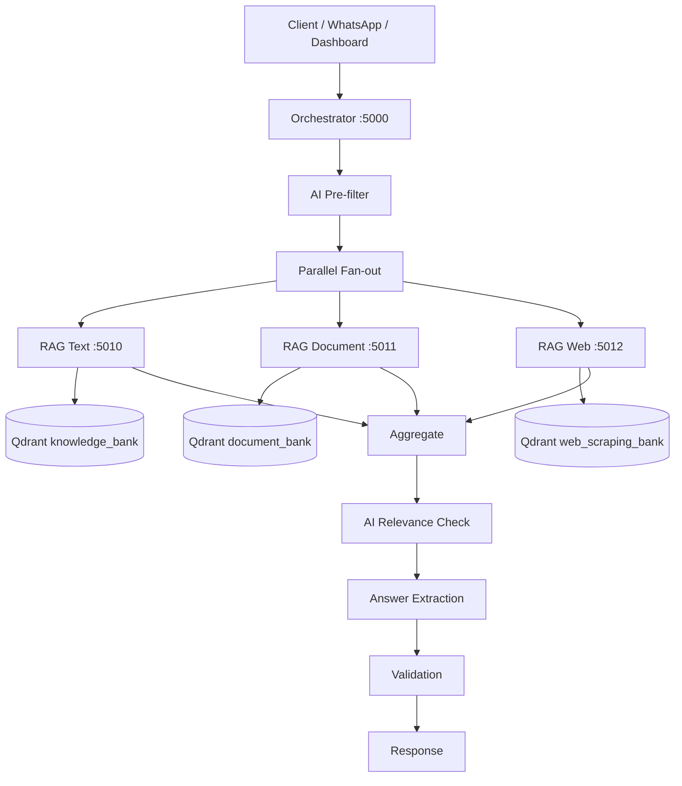

Current drawbacks:

1. Search logic terduplikasi di banyak service.
2. Tiga retrieval spaces tidak memiliki shared graph.
3. Cross-source relationship tidak direpresentasikan.
4. Dense score dari masing-masing source harus dinormalisasi/diaggregasi manual.
5. Reranking terjadi pada beberapa layer.
6. Banyak LLM call digunakan hanya untuk relevance checking.
7. Orchestrator membawa terlalu banyak retrieval responsibility.

---

# 6. Target Architecture — RAG Medan v4

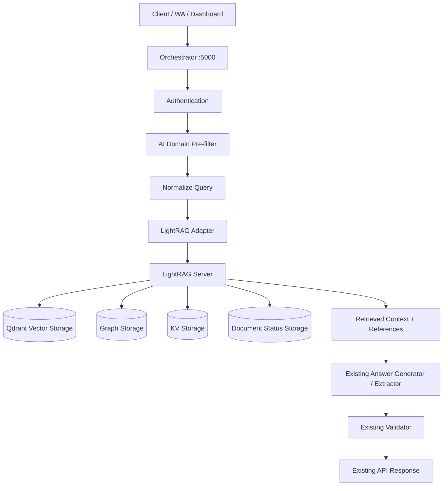

---

# 7. Knowledge Ingestion Architecture

Semua authoritative knowledge masuk ke logical LightRAG knowledge base yang sama.

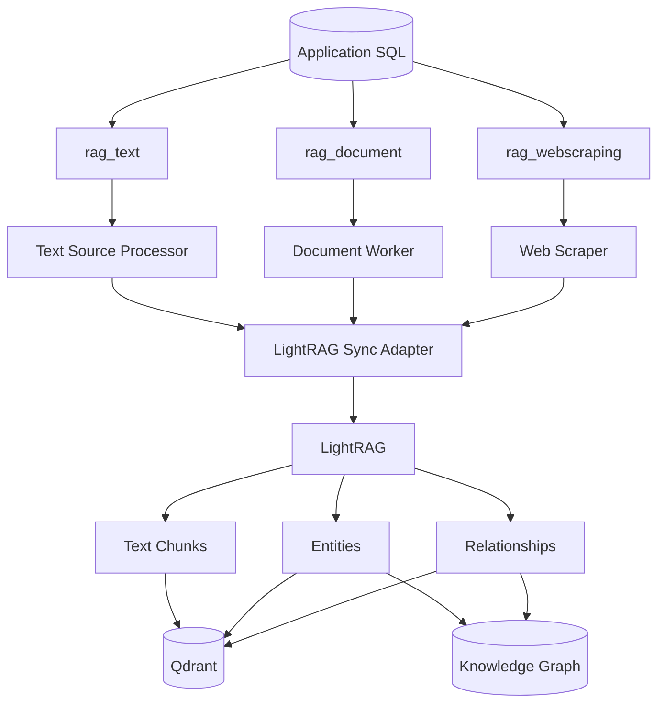

---

# 8. Search Workflow

## 8.1 Target Search Flow

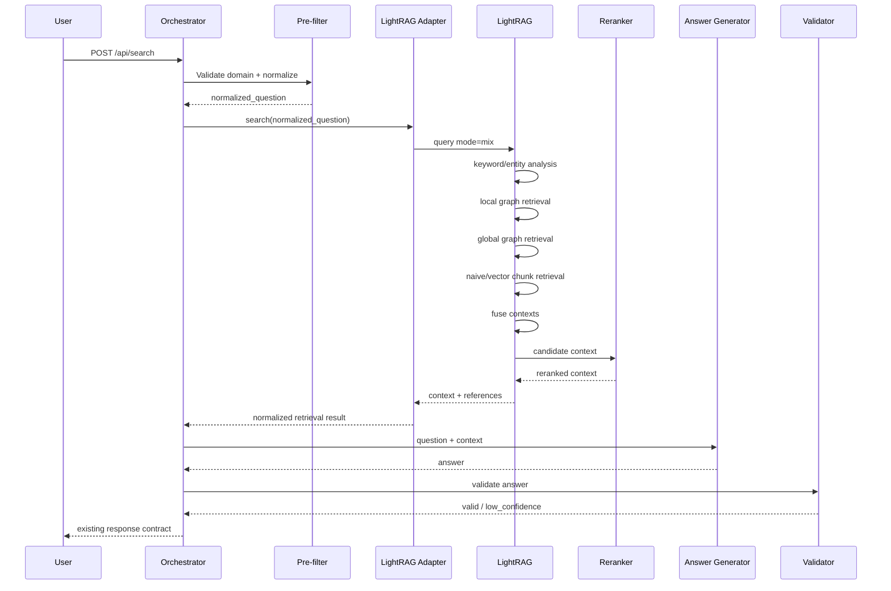

---

## 8.2 Query Mode

Default target:

```text
mode = mix
```

`mix` dipilih karena LightRAG menggabungkan:

- local retrieval
- global retrieval
- naive/vector chunk retrieval

Tujuan:

```text
Specific fact
+
Entity context
+
Cross-document relationships
+
Original text chunks
```

Untuk debugging/benchmark, mode berikut tetap harus dapat dipilih melalui config:

```text
naive
local
global
hybrid
mix
```

---

# 9. LightRAG Adapter

Tambahkan service baru:

```text
services/lightrag_adapter/
```

Suggested port:

```text
5015
```

Struktur:

```text
services/lightrag_adapter/
├── main.py
├── config.py
├── client.py
├── models.py
├── search.py
├── sync.py
├── source_mapper.py
├── references.py
├── errors.py
└── health.py
```

Tanggung jawab:

- hide LightRAG implementation details
- translate existing application payload to LightRAG
- translate LightRAG result to internal canonical result
- map source IDs
- map citations
- retry/transient error handling
- health checking
- metrics
- fallback routing during migration

---

# 10. Internal LightRAG Adapter API

## 10.1 Search

```http
POST /internal/search
```

Request:

```json
{
  "query": "Bagaimana prosedur pengajuan cuti?",
  "knowledge_base_id": "medan-main",
  "mode": "mix",
  "top_k": 10,
  "include_references": true
}
```

Canonical response:

```json
{
  "status": "success",
  "engine": "lightrag",
  "query": "Bagaimana prosedur pengajuan cuti?",
  "contexts": [
    {
      "content": "....",
      "source_type": "document",
      "source_id": "123",
      "title": "SOP Kepegawaian",
      "source_uri": "document://123",
      "reference_id": "1"
    }
  ],
  "references": [],
  "timing": {
    "retrieval_sec": 0.0,
    "rerank_sec": 0.0,
    "total_sec": 0.0
  }
}
```

Do not expose raw LightRAG payload directly to Orchestrator.

---

## 10.2 Sync Text

```http
POST /internal/sync/text
```

```json
{
  "source_id": "123",
  "knowledge_base_id": "medan-main",
  "title": "Cara Mengurus KTP",
  "content": "....",
  "content_hash": "...",
  "is_active": true
}
```

---

## 10.3 Sync Document

```http
POST /internal/sync/document
```

```json
{
  "source_id": "456",
  "knowledge_base_id": "medan-main",
  "title": "SOP Pelayanan",
  "normalized_content": "....",
  "file_name": "sop-pelayanan.pdf",
  "file_hash": "...",
  "content_hash": "...",
  "is_active": true
}
```

---

## 10.4 Sync Web

```http
POST /internal/sync/web
```

```json
{
  "source_id": "789",
  "knowledge_base_id": "medan-main",
  "url": "https://example.go.id/page",
  "title": "Pelayanan Publik",
  "clean_content": "....",
  "content_hash": "...",
  "is_active": true
}
```

---

## 10.5 Delete Source

```http
DELETE /internal/source/{source_type}/{source_id}
```

Deletion must remove/reconcile LightRAG document data associated with the logical source.

---

## 10.6 Reindex

```http
POST /internal/reindex/{source_type}/{source_id}
```

---

# 11. Stable Source Identity

Setiap source harus memiliki deterministic logical ID.

Format:

```text
kb:{knowledge_base_id}:{source_type}:{source_id}
```

Examples:

```text
kb:medan-main:text:123
kb:medan-main:document:456
kb:medan-main:web:789
```

Tujuan:

- idempotent sync
- update
- deletion
- debugging
- citation mapping
- reindex
- disaster recovery

---

# 12. Logical Source URI

Gunakan logical source path untuk traceability:

Text:

```text
sql://rag_text/123
```

Document:

```text
document://456/sop-pelayanan.pdf
```

Web:

```text
https://example.go.id/page
```

Adapter bertugas menerjemahkan references LightRAG kembali menjadi source application.

---

# 13. RAG Text Workflow

## 13.1 Existing

```text
SQL
↓
rag_text
↓
E5-small
↓
knowledge_bank
↓
Qdrant search
```

## 13.2 New

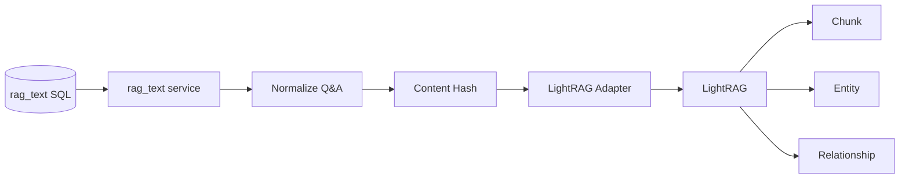

Suggested normalized content:

```text
Title: {title}

Question:
{question}

Answer:
{answer}

Category:
{category}
```

Rules:

- preserve original meaning
- do not synthesize new facts during ingestion
- retain application source ID
- skip re-index when `content_hash` unchanged
- delete from LightRAG when source becomes inactive/deleted

---

# 14. RAG Document Workflow

## 14.1 Existing Pipeline to Preserve

Keep:

```text
Download
File hash
Content hash
PyMuPDF/layout extraction
OCR fallback
Image OCR
XLSX extraction
Progress reporting
Webhook
Error isolation
```

Existing specialized document processing remains valuable.

---

## 14.2 New Document Flow

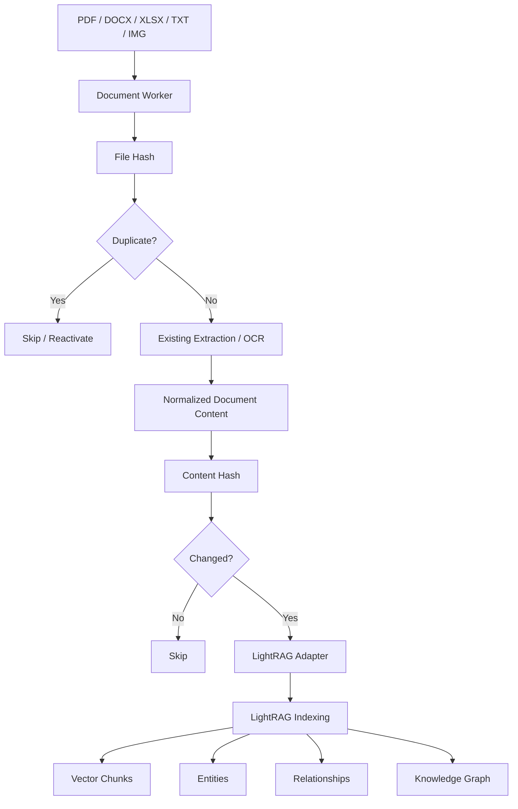

---

## 14.3 Chunking Strategy

During initial migration:

**Do not preserve old parent-child chunks as the LightRAG input.**

Preferred input:

```text
normalized full document content
```

LightRAG should own its internal chunking for the new index.

Reason:

- graph extraction should operate over LightRAG's expected chunk lifecycle
- entity and relation source mapping remains consistent
- avoids double chunking

However, existing parent-child pipeline may remain alive exclusively for legacy fallback during migration.

---

## 14.4 Future Document Processing Option

After LightRAG is stable, evaluate replacing some parsing/OCR steps with LightRAG's native document pipeline.

Available LightRAG parser ecosystem includes:

- Native
- MinerU
- Docling
- Legacy fallback

Available chunking strategies include:

- Fixed
- Recursive
- Vector semantic
- Paragraph semantic

**This is not part of Phase 1.**

Phase 1 uses the existing Document Worker as the trusted normalization layer.

---

# 15. RAG Web Workflow

## 15.1 Existing Components to Preserve

Keep:

- URL scheduling
- `httpx`
- Playwright fallback
- CSS selector support
- main-content cleaner
- script/style/nav/footer removal
- FAQ extraction
- domain rate limiting
- content hashing
- last scrape state
- webhook callback

---

## 15.2 New Web Flow

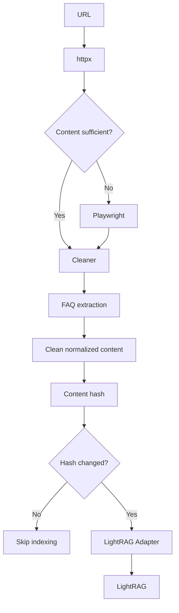

Crawler and LightRAG responsibilities must remain separate.

```text
Crawler
= acquire and clean web content

LightRAG
= index and retrieve knowledge
```

---

# 16. RAG Usulan

`rag_usulan` remains separate in Phase 1.

Reason:

- user-generated data
- potentially noisy
- operational domain
- may require filters/metadata semantics different from authoritative knowledge
- mixing it into authoritative graph may contaminate answers

Architecture:

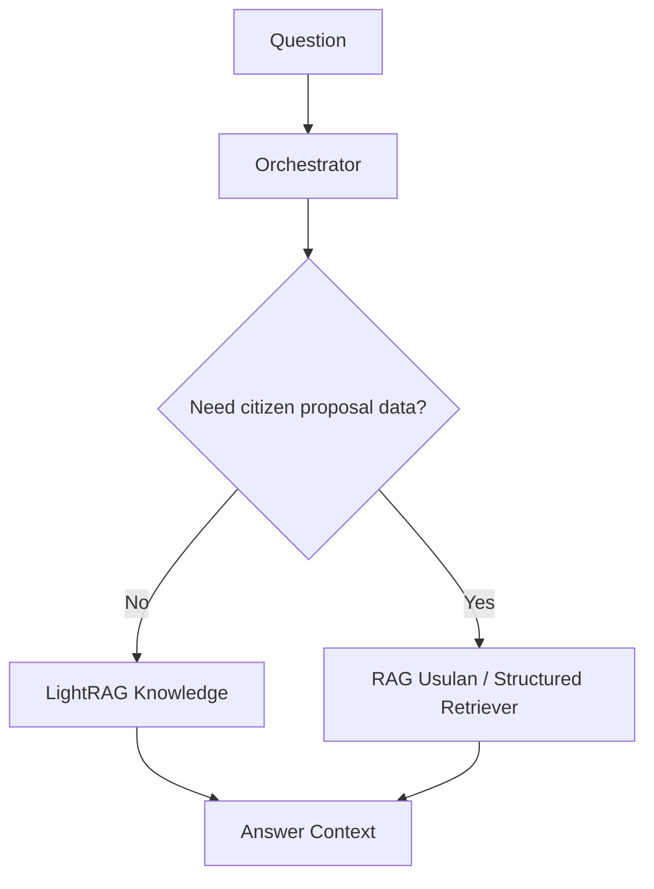

Future integration is optional and requires separate evaluation.

---

# 17. LightRAG Storage

LightRAG requires four logical storage categories:

```text
KV_STORAGE
VECTOR_STORAGE
GRAPH_STORAGE
DOC_STATUS_STORAGE
```

## 17.1 Recommended Initial Deployment

```text
VECTOR_STORAGE
= QdrantVectorDBStorage

GRAPH_STORAGE
= Neo4j / PGTableGraphStorage / NetworkX for dev

KV_STORAGE
= PostgreSQL or supported persistent backend

DOC_STATUS_STORAGE
= PostgreSQL or supported persistent backend
```

For production, avoid development-only in-memory/file-backed storage.

---

## 17.2 Qdrant

Existing Qdrant server can be reused, but LightRAG must manage its own logical vector data.

Do not reuse old collections as if they were native LightRAG collections.

Old:

```text
knowledge_bank
document_bank
web_scraping_bank
usulan_bank
```

LightRAG:

```text
chunk vectors
entity vectors
relationship vectors
```

Legacy collections remain available during migration/fallback.

---

# 18. Workspace Strategy

One authoritative knowledge base should use one logical LightRAG workspace.

Example:

```text
WORKSPACE=medan-main
```

Inside that workspace:

```text
rag_text
+
rag_document
+
rag_web
```

Do **not** use:

```text
workspace=text
workspace=document
workspace=web
```

because cross-source relations must be allowed.

If later there are truly isolated knowledge bases:

```text
medan-public
medan-internal
department-a
department-b
```

each can use a different workspace.

---

# 19. Embedding Strategy

Existing system:

```text
Text      -> 384
Web       -> 384
Usulan    -> 384
Document  -> 1024
```

Target LightRAG requires one consistent embedding model/dimension per knowledge index.

Initial target:

```text
LightRAG primary embedding
= existing E5-small-compatible model
= 384 dimensions
```

Important:

- exact E5 checkpoint must be explicitly configured
- indexing and querying must use the same model
- embedding model must be locked before production reindex
- changing embedding model later requires rebuilding LightRAG vector data

The existing 1024-dimension Document index remains only for legacy fallback during migration.

---

# 20. Shared Embedding Service

Existing service:

```text
embedding_service :5014
```

should be retained if it can be exposed in a LightRAG-compatible adapter.

Target:

```text
LightRAG
   ↓
Embedding Adapter
   ↓
Embedding Service :5014
   ↓
E5-small 384
```

Benefits:

- one loaded model
- lower RAM usage
- no duplicate local model process
- centralized batching
- centralized monitoring

If direct integration is not clean, deploy a dedicated LightRAG embedding endpoint but keep model choice identical.

---

# 21. Reranking

Enable reranking after baseline LightRAG retrieval is stable.

Target:

```text
LightRAG mix retrieval
        ↓
Dedicated Reranker
        ↓
Top context
```

Preferred architectural rule:

```text
Dedicated reranker > repeated LLM relevance classification
```

Legacy AI relevance check stays available behind a feature flag during migration.

Config concept:

```text
USE_LIGHTRAG_RERANK=true
USE_LEGACY_AI_RELEVANCE=false
```

---

# 22. Orchestrator Changes

## 22.1 Keep

```text
Authentication
AI domain pre-filter
Query normalization
Request validation
Answer generation
Answer validation
Response builder
Timing
Logging
Fallback
```

## 22.2 Remove from Target Path

```text
parallel fan-out text/document/web
dense-score comparison between services
manual lexical aggregation
category score boost for cross-service fusion
per-service LLM rerank
adaptive early-exit based only on dense_score
```

---

# 23. New Orchestrator Flow

```text
POST /api/search
    │
    ├── [1] Authentication
    │
    ├── [2] AI Domain Pre-filter
    │
    ├── [3] Normalize Question
    │
    ├── [4] LightRAG Search
    │       ├── mode=mix
    │       ├── graph retrieval
    │       ├── chunk vector retrieval
    │       ├── fusion
    │       └── rerank
    │
    ├── [5] Context Validation
    │
    ├── [6] Answer Generation / Extraction
    │
    ├── [7] Answer Validation
    │
    └── [8] Existing Response Contract
```

---

# 24. Answer Generation Strategy

Phase 1 target:

```text
LightRAG
= retrieval only

Existing LLM pipeline
= final answer generation
```

Flow:

```text
Question
 ↓
LightRAG
 ↓
Context + References
 ↓
Existing Answer Generator
 ↓
Existing Validator
```

Do not move final-answer responsibility into LightRAG until retrieval quality has been validated.

Future optional mode:

```text
LIGHTRAG_GENERATES_ANSWER=true
```

must remain disabled initially.

---

# 25. Context Validation

Before answer generation:

Reject or return low confidence when:

- retrieval context empty
- all references invalid
- context does not meet minimum relevance threshold
- source was deleted/inactive
- source mapping cannot be resolved
- retrieval timed out and fallback also failed

Never fill missing institutional knowledge from model memory.

---

# 26. Citation and Source Traceability

Every final answer should be traceable to application source.

Canonical source fields:

```json
{
  "source_type": "document",
  "source_id": "456",
  "title": "SOP Pelayanan",
  "url": null,
  "file_name": "sop-pelayanan.pdf",
  "reference_id": "1"
}
```

For web:

```json
{
  "source_type": "web",
  "source_id": "789",
  "title": "Pelayanan Publik",
  "url": "https://example.go.id/page"
}
```

For text:

```json
{
  "source_type": "text",
  "source_id": "123",
  "title": "Cara Mengurus KTP"
}
```

Citation mapping belongs in the Adapter, not in UI.

---

# 27. Sync State Model

Add centralized LightRAG sync state.

Recommended statuses:

```text
PENDING
INDEXING
INDEXED
OUTDATED
FAILED
DELETING
DELETED
```

Recommended registry:

```text
knowledge_index_state
────────────────────────────────────
id
knowledge_base_id
source_type
source_id
lightrag_document_id
content_hash
version
sync_status
track_id
sync_error
indexed_at
created_at
updated_at
```

Unique constraint:

```text
(knowledge_base_id, source_type, source_id)
```

---

# 28. Idempotency

Every sync operation must be idempotent.

Pseudo-rule:

```text
new_hash == indexed_hash
    ↓
SKIP

new_hash != indexed_hash
    ↓
REINDEX
```

Delete:

```text
is_active=false
or
is_deleted=true
    ↓
remove/reconcile LightRAG document
```

---

# 29. Failure Handling

## 29.1 LightRAG Unavailable

During migration:

```text
LightRAG unavailable
        ↓
Legacy RAG fallback
```

After legacy retirement:

```text
LightRAG unavailable
        ↓
controlled service_unavailable
```

Never silently hallucinate an answer.

---

## 29.2 Indexing Failure

```text
sync_status=FAILED
sync_error=<safe error message>
```

Source data remains untouched.

Retry must be safe and idempotent.

---

## 29.3 Partial Storage Failure

Treat LightRAG indexing as one logical transaction from application perspective.

Do not mark source `INDEXED` until LightRAG reports successful processing.

---

# 30. Security

All LightRAG access must be internal.

```text
Internet
  X
  |
LightRAG
```

Allowed:

```text
Orchestrator
     ↓
LightRAG Adapter
     ↓
LightRAG Server
```

Requirements:

- LightRAG API authentication enabled
- do not expose LightRAG directly to public network
- internal firewall/private network
- secret management via environment/secrets
- never log full API keys
- sanitize source content before logs
- maintain existing `X-API-Key` between application services
- limit upload/request size
- configure reverse proxy appropriately if used

---

# 31. Observability

Existing timing breakdown must be retained and expanded.

Recommended:

```json
{
  "timing": {
    "ai_domain_sec": 0.0,
    "query_normalize_sec": 0.0,
    "lightrag_total_sec": 0.0,
    "retrieval_sec": 0.0,
    "rerank_sec": 0.0,
    "answer_generation_sec": 0.0,
    "validation_sec": 0.0,
    "total_sec": 0.0
  }
}
```

Metrics:

```text
rag_search_total
rag_search_success
rag_search_low_confidence
lightrag_query_latency
lightrag_query_error
lightrag_index_total
lightrag_index_failed
lightrag_index_duration
lightrag_reindex_total
lightrag_reference_count
fallback_to_legacy_total
```

---

# 32. Logging

Every request should carry:

```text
request_id
trace_id
knowledge_base_id
engine
query_mode
fallback_used
source_count
reference_count
latency
status
```

Do not log:

- secrets
- raw authentication headers
- full sensitive document content

---

# 33. Feature Flags

Required:

```text
RAG_SEARCH_ENGINE=legacy|lightrag|shadow
LIGHTRAG_QUERY_MODE=mix
LIGHTRAG_RERANK_ENABLED=true|false
LIGHTRAG_FALLBACK_TO_LEGACY=true|false
LIGHTRAG_GENERATES_ANSWER=false
LIGHTRAG_INDEX_TEXT=true
LIGHTRAG_INDEX_DOCUMENT=true
LIGHTRAG_INDEX_WEB=true
```

---

# 34. Migration Strategy

## Phase 0 — Preparation

- deploy LightRAG
- configure storage
- configure embedding
- configure graph backend
- configure Adapter
- create sync-state table
- no production traffic yet

---

## Phase 1 — Reindex / Shadow Mode

```text
Production query
   ↓
Legacy RAG
   ↓
User answer

Parallel:
same query
   ↓
LightRAG
   ↓
evaluation only
```

Config:

```text
RAG_SEARCH_ENGINE=shadow
```

Goals:

- compare recall
- compare answer context
- compare latency
- discover indexing errors
- evaluate graph quality

No LightRAG result is shown to user in this phase.

---

## Phase 2 — Primary + Legacy Fallback

```text
Query
 ↓
LightRAG
 ↓
success?
 ├─ yes → answer
 └─ no  → Legacy RAG
```

Config:

```text
RAG_SEARCH_ENGINE=lightrag
LIGHTRAG_FALLBACK_TO_LEGACY=true
```

---

## Phase 3 — LightRAG Primary Stable

- LightRAG handles normal retrieval
- legacy search endpoints remain temporarily available
- track fallback rate
- eliminate obsolete aggregation logic

Exit criterion:

```text
fallback rate sufficiently low
+
retrieval quality accepted
+
latency accepted
+
index sync stable
```

---

## Phase 4 — Retire Legacy Search

Remove only after validated:

```text
rag_text search
rag_document search
rag_web search
parallel fan-out
legacy aggregate
legacy relevance reranking
old Qdrant search path
```

Do not remove source processing services.

Final:

```text
rag_text     -> ingestion
rag_document -> OCR/document processing
rag_web      -> crawling
LightRAG     -> indexing + retrieval
```

---

# 35. Reindex Strategy

Because SQL is source of truth:

```text
SQL
 ↓
sync_all()
 ↓
LightRAG rebuild
```

Suggested reindex command/service:

```http
POST /internal/reindex-all
```

Processing order:

```text
1. rag_text
2. rag_document normalized content
3. rag_web clean content
```

Support:

- batch size
- concurrency limit
- retry
- checkpoint
- resumability
- dry-run
- progress reporting

---

# 36. Search Quality Evaluation

Create a curated benchmark set.

Minimum categories:

1. exact FAQ
2. paraphrased FAQ
3. document factual
4. web factual
5. cross-source
6. cross-document
7. multi-hop relationship
8. ambiguous question
9. typo/noisy Indonesian
10. acronym/code lookup
11. out-of-domain
12. insufficient knowledge
13. conflicting sources
14. stale web data
15. long question

Compare:

```text
Legacy RAG
LightRAG naive
LightRAG mix
LightRAG mix + reranker
```

Metrics:

- retrieval hit rate
- context precision
- context recall
- answer correctness
- groundedness
- citation correctness
- hallucination rate
- latency
- LLM calls
- token cost
- memory/CPU

---

# 37. Acceptance Criteria

LightRAG can become primary when:

- all three authoritative source types successfully sync
- reindex is idempotent
- delete/update work reliably
- citation mapping works
- query mode `mix` works
- context can be returned without depending on LightRAG final generation
- existing response contract remains compatible
- no public LightRAG exposure
- system survives LightRAG restart
- indexing status is observable
- search failure has safe fallback
- quality benchmark is at least equivalent to legacy for simple factual queries
- LightRAG improves or matches complex/cross-source queries
- latency remains within accepted project SLA

---

# 38. Suggested Project Structure

```text
rag-medan-v4/
├── orchestrator/
│   ├── orchestrator.py
│   ├── search_handler.py
│   ├── answer_validation.py
│   ├── response_builder.py
│   └── models.py
│
├── services/
│   ├── rag_text/
│   │   ├── main.py
│   │   ├── sync.py
│   │   └── normalizer.py
│   │
│   ├── rag_document/
│   │   ├── main.py
│   │   ├── worker.py
│   │   ├── extractors/
│   │   ├── ocr/
│   │   └── normalizer.py
│   │
│   ├── rag_web/
│   │   ├── main.py
│   │   ├── scraper.py
│   │   ├── cleaner.py
│   │   ├── faq_extractor.py
│   │   └── scheduler.py
│   │
│   ├── rag_usulan/
│   │   └── ...
│   │
│   ├── embedding_service/
│   │   └── ...
│   │
│   └── lightrag_adapter/
│       ├── main.py
│       ├── config.py
│       ├── client.py
│       ├── models.py
│       ├── search.py
│       ├── sync.py
│       ├── source_mapper.py
│       ├── references.py
│       ├── fallback.py
│       └── health.py
│
├── shared/
│   ├── db.py
│   ├── security.py
│   ├── logging.py
│   ├── metrics.py
│   └── models/
│
├── tests/
│   ├── unit/
│   ├── integration/
│   ├── retrieval/
│   └── migration/
│
├── ecosystem.config.js
├── docker-compose.lightrag.yml
└── .env
```

---

# 39. Service Topology

Suggested:

```text
5000  Orchestrator
5010  RAG Text / ingestion
5011  RAG Document / ingestion
5012  RAG Web / ingestion
5013  RAG Usulan
5014  Embedding Service
5015  LightRAG Adapter
9621  LightRAG Server (internal only)
```

Ports are implementation defaults and may be changed by configuration.

---

# 40. End-to-End Document Example

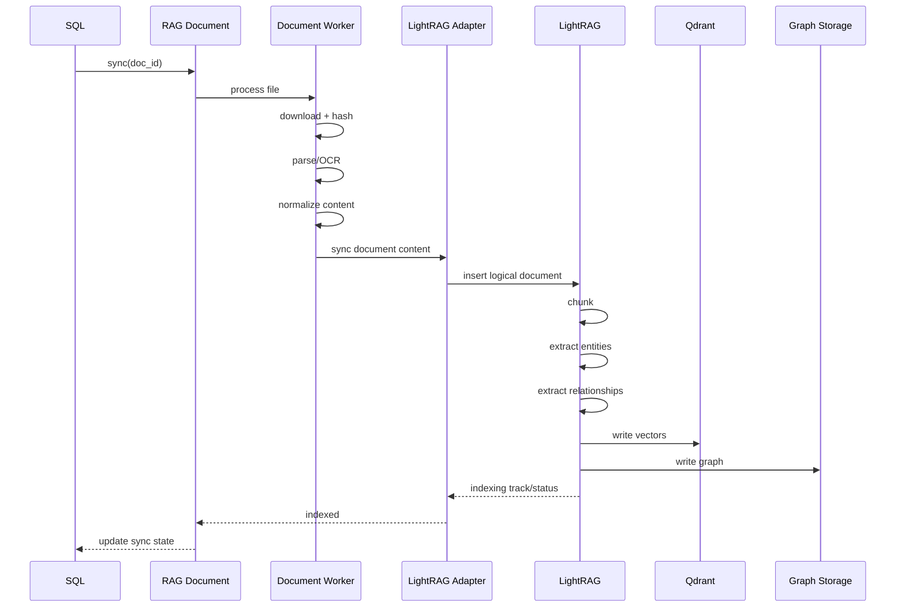

---

# 41. End-to-End Web Example

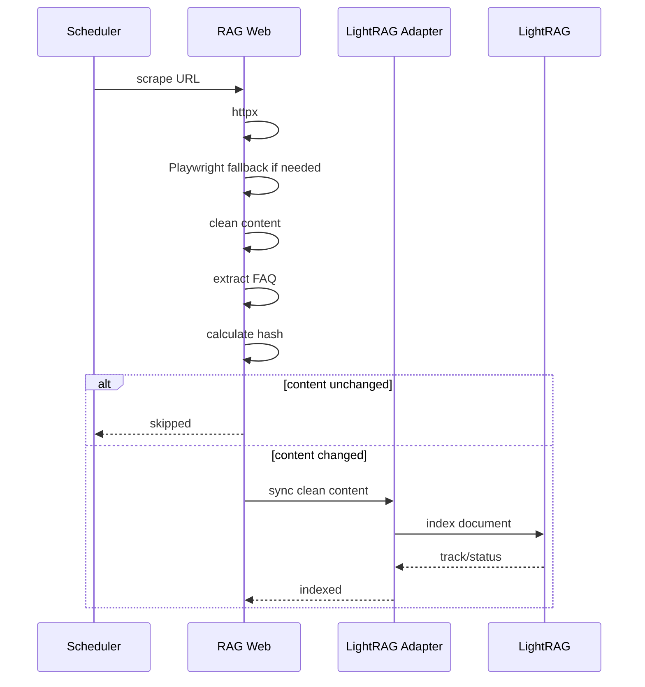

---

# 42. End-to-End Search Example

Question:

```text
OPD mana yang menangani layanan X dan apa dasar aturan pelayanannya?
```

Possible indexed knowledge:

```text
rag_text:
"Layanan X ditangani oleh Dinas A."

rag_document:
"Perwal 10/2026 mengatur prosedur layanan X."

rag_web:
"Dinas A menyediakan layanan X melalui Unit B."
```

LightRAG can retrieve a unified context:

```text
Dinas A
   │
   ├── handles → Layanan X
   │
   └── contains → Unit B

Layanan X
   │
   └── regulated_by → Perwal 10/2026
```

Then:

```text
LightRAG Context
       ↓
Existing Answer Generator
       ↓
Grounded Answer
       ↓
References:
- rag_text
- rag_document
- rag_web
```

---

# 43. Legacy Compatibility

Existing external endpoint remains:

```http
POST /api/search
```

Existing clients should not need to know:

```text
whether retrieval uses:
legacy
or
LightRAG
```

Engine selection is server-side.

Canonical strategy:

```text
Client API
   ↓
Orchestrator
   ↓
Search Provider Interface
   ├── LegacySearchProvider
   └── LightRAGSearchProvider
```

Suggested interface:

```python
class SearchProvider:
    async def search(self, query, options):
        ...
```

---

# 44. Search Provider Abstraction

Implement:

```text
SearchProvider
│
├── LegacySearchProvider
└── LightRAGSearchProvider
```

Benefits:

- clean migration
- easy A/B testing
- safe rollback
- easier tests
- no if/else scattered throughout Orchestrator

---

# 45. Configuration

Example conceptual environment variables:

```text
RAG_SEARCH_ENGINE=lightrag

LIGHTRAG_BASE_URL=http://127.0.0.1:9621
LIGHTRAG_API_KEY=***
LIGHTRAG_WORKSPACE=medan-main
LIGHTRAG_QUERY_MODE=mix
LIGHTRAG_RERANK_ENABLED=true
LIGHTRAG_FALLBACK_TO_LEGACY=true

LIGHTRAG_INDEX_TEXT=true
LIGHTRAG_INDEX_DOCUMENT=true
LIGHTRAG_INDEX_WEB=true

LIGHTRAG_ADAPTER_PORT=5015

EMBEDDING_DIMENSION=384
```

Exact variable names should follow the installed LightRAG version and application config conventions.

---

# 46. Important LightRAG Constraints

The implementation must respect:

1. Embedding model must remain consistent between indexing and querying.
2. Changing embedding model requires vector rebuild/reindex.
3. Storage backend must be chosen before production indexing.
4. LightRAG manages vector data for:
   - chunks
   - entities
   - relationships
5. LightRAG requires separate logical storage for:
   - KV
   - Vector
   - Graph
   - Document Status
6. Workspace controls knowledge isolation.
7. Reranking increases retrieval quality but may increase latency.
8. File-processing configuration changes only affect newly processed/re-uploaded files.
9. Text insertion and file upload are not identical processing paths; because this design sends normalized existing OCR/scrape output, the Adapter must explicitly choose the appropriate ingestion method and benchmark it.

---

# 47. Testing Requirements

## Unit Tests

- source ID generation
- source URI generation
- payload mapping
- reference mapping
- hash comparison
- sync-state transitions
- fallback behavior
- response compatibility

## Integration Tests

- Text -> LightRAG
- Document -> LightRAG
- Web -> LightRAG
- update
- delete
- reindex
- LightRAG restart
- Qdrant restart
- graph backend restart
- timeout
- malformed response

## Retrieval Tests

- naive
- local
- global
- hybrid
- mix
- reranker enabled
- reranker disabled

## Regression Tests

Old public endpoint must continue returning compatible response structure.

---

# 48. Rollback Strategy

Rollback must not require data restoration.

Because SQL is source of truth:

```text
RAG_SEARCH_ENGINE=legacy
```

immediately routes search back to old system during migration.

LightRAG index remains available for debugging.

No source data is lost.

---

# 49. Disaster Recovery

If all LightRAG derived storage is lost:

```text
Qdrant deleted
Graph deleted
KV deleted
Doc status deleted
```

Recovery:

```text
Application SQL
        +
Stored original files / normalized content
        +
Web source configuration
        ↓
Reindex pipeline
        ↓
LightRAG rebuilt
```

This is an explicit design requirement.

---

# 50. Final Responsibility Matrix

| Component | Responsibility |
|---|---|
| Orchestrator | API, auth, query flow, answer generation, validation |
| RAG Text | Text/Q&A source normalization and sync |
| RAG Document | Download, OCR, extraction, normalization |
| RAG Web | Crawling, cleaning, scheduling, dedup |
| RAG Usulan | Separate citizen proposal retrieval |
| LightRAG Adapter | Contract translation and integration |
| LightRAG | Unified index + graph/vector retrieval |
| Qdrant | LightRAG vector storage |
| Graph DB | Entity/relationship graph |
| SQL | Source of truth |
| Embedding Service | Shared embedding execution where compatible |
| Reranker | Context ranking |
| Existing LLM | Final answer generation |
| Validator | Grounded/safe response validation |

---

# 51. Final Architecture Summary

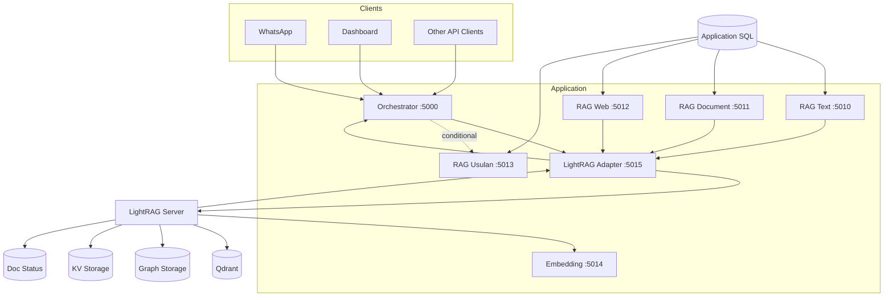

---

# 52. Core Design Decision

The final system should be understood as:

```text
EXISTING RAG MEDAN
= Application + Ingestion Infrastructure

LIGHTRAG
= Knowledge Index + Retrieval Engine
```

Not:

```text
Existing RAG Medan
    ↓
DELETE
    ↓
LightRAG
```

But:

```text
Existing source processors
        +
LightRAG unified engine
        =
RAG Medan v4
```

---

# 53. Implementation Rule for AI Builder

When implementing this specification:

1. **Do not rewrite unrelated existing services.**
2. Inspect existing code before changing architecture.
3. Preserve existing endpoint contracts unless explicitly migrated.
4. Introduce LightRAG through an Adapter/Provider abstraction.
5. Keep SQL as source of truth.
6. Keep old Qdrant search available during migration.
7. Never couple domain tables directly to LightRAG internal storage schema.
8. Never expose LightRAG directly to public clients.
9. Do not duplicate OCR/web scraping functionality inside LightRAG during Phase 1.
10. Do not mix `rag_usulan` into authoritative knowledge automatically.
11. Use deterministic source IDs.
12. Make sync idempotent.
13. Make every LightRAG-derived store rebuildable.
14. Add tests before retiring legacy retrieval.
15. Measure retrieval quality before changing embedding model.
16. Keep answer generation outside LightRAG during initial rollout.
17. Maintain citation/source mapping from retrieved context to original application records.
18. Prefer configuration and feature flags over hardcoded migration behavior.

---

# 54. Definition of Done

The LightRAG integration is considered complete when:

- `rag_text` automatically indexes into LightRAG
- `rag_document` normalized OCR output indexes into LightRAG
- `rag_web` cleaned content indexes into LightRAG
- updates and deletes propagate correctly
- content hash prevents unnecessary re-index
- LightRAG `mix` is primary retrieval mode
- references map to original sources
- existing `/api/search` still works
- answer validation still works
- `rag_usulan` remains independently queryable
- shadow benchmark has been completed
- primary/fallback routing works
- disaster reindex from SQL succeeds
- legacy retrieval can be disabled without breaking ingestion
- monitoring exposes indexing and query health
- security prevents direct public access to LightRAG
- regression tests pass

---

# 55. Technical Reference Notes

This design is based on two inputs:

1. **Existing RAG Medan v3 architecture**
   - Orchestrator + source-specific microservices
   - Qdrant collections
   - shared embedding service
   - custom document OCR
   - web scraping
   - relevance/answer validation pipeline

2. **Current LightRAG capabilities verified from the official HKUDS/LightRAG repository**
   - query modes: `local`, `global`, `hybrid`, `naive`, `mix`
   - `mix` combines local/global/naive retrieval
   - reranker support
   - Qdrant vector storage support
   - workspace isolation
   - custom/persistent storage backends
   - vector storage for chunks/entities/relationships
   - graph storage for entity relationships
   - KV and document-status storage
   - asynchronous document indexing/progress tracking
   - parser engines including Native, MinerU, Docling and legacy paths
   - chunking strategies including Fixed, Recursive, Vector semantic and Paragraph semantic
   - source references and chunk content support in query responses
   - strict embedding consistency requirement between indexing and querying

Implementation must verify exact configuration keys and API schema against the pinned LightRAG version used by the project before coding.

---

**End of PRD — LightRAG Engine Integration**
